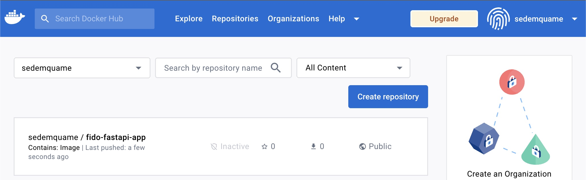
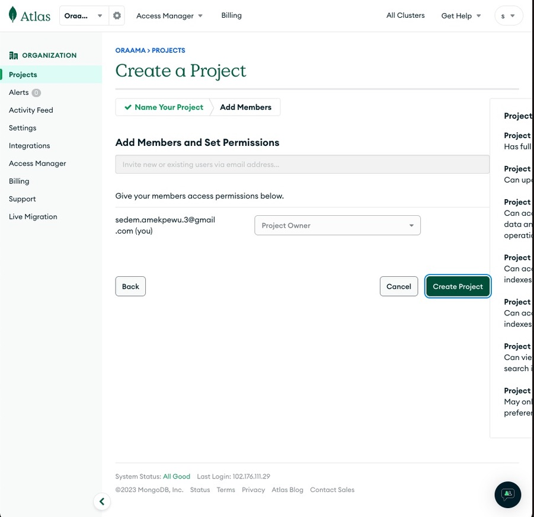
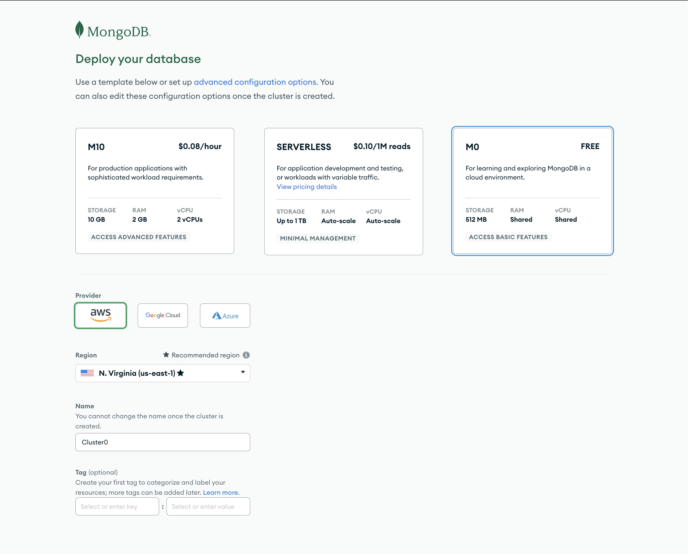
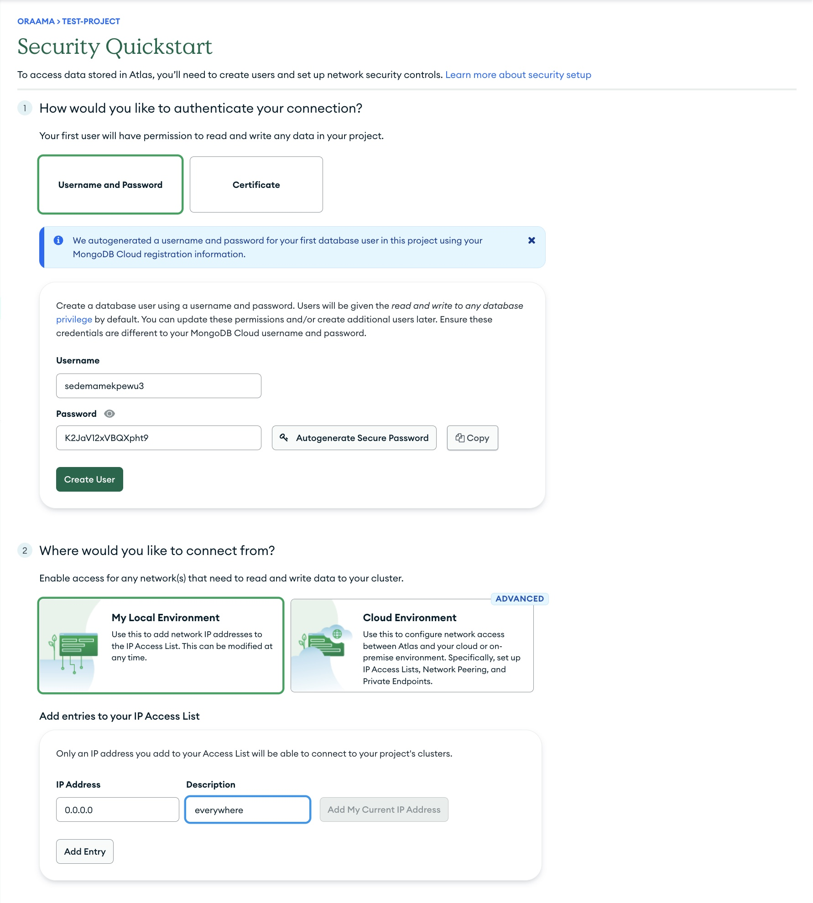
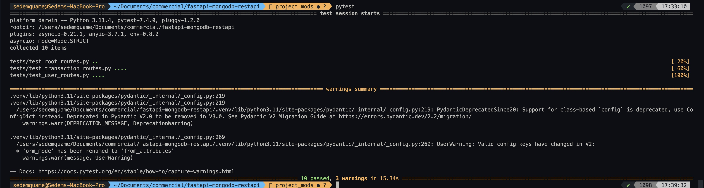
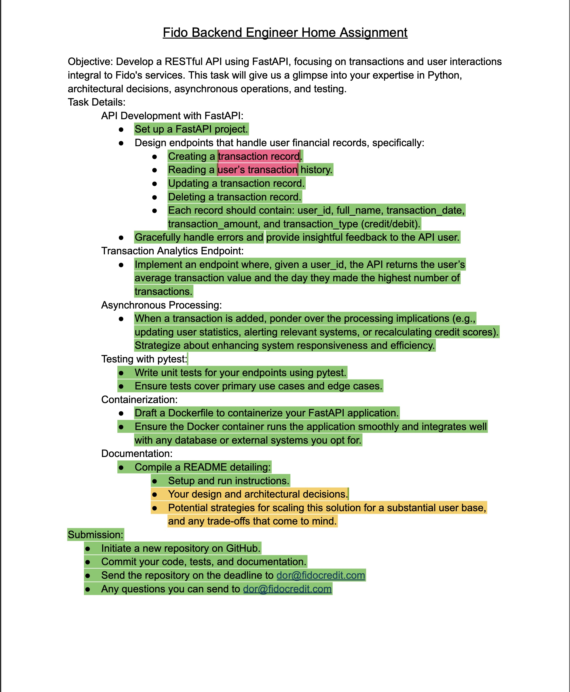

# Setting Up A FASTAPI Service for FIDO CREDIT.

## Prerequisites

- To run this program, you need to create add the following environment variables.

```SHELL
// Specify your MongoDB credentials.
$ export MONGO_DB_NAME=
$ export MONGO_URI=

// Specify your Twilio credentials to send SMS.
$ export TWILIO_ACCOUNT_SID=
$ export TWILIO_AUTH_TOKEN=

```

#### A step-by-step guide to running this program locally.

- Clone the repository: `git clone https://github.com/SedemQuame/fastapi-restapi-assignment.git` or download as a zip file and extract it on your computer.

- Change directory into the root directory of this project.

- Setup a virtual environment for this project, by running the command `virtualenv venv`.

- Activate the virtual environment, by running the following commands

For Linux/Mac

```
source venv/bin/activate
```

For Windows

```
source venv/Scripts/activate
```

- Install the various requirements to run this project by running the command
  `pip install -r requirements.txt`

- Start the fast-api server locally by using the following command.
  `uvicorn app.index:app --reload`

#### A step-by-step guide to running this program from a docker container.

In this section I will cover how to build this docker application from scratch and deploy it to a docker repository, in this case docker hub.

- Navigate to the root of this project's directory, where the Dockerfile is located.
- Make sure docker is running on the computer.
- Build a docker image, by running the command
  `docker build -t fido-fastapi-app:latest .`
- The new image can be run locally by using the command.
  `docker run -p 8000:8000 fido-fastapi-app:latest`, which exposes the application via port 8000. Now, you should be able to access this application by opening a web browser and navigating to http://localhost:8000.
- Pushing to the docker registry is done by login into docker hub from CLI by running `docker login`.
- Tagging the image with your user name for easy identification.
  `docker tag fido-fastapi-app:latest sedemquame/fido-fastapi-app:latest`.
- The resulting image was pushed using the command
  `docker push sedemquame/fido-fastapi-app:latest`.
  
- Pulling the container from the docker registry.
  `docker pull sedemquame/fido-fastapi-app:latest`
- To run the downloaded container, use the container
  `docker run -p 8000:8000 sedemquame/fido-fastapi-app:latest`, this can also be access from http://localhost:8000

#### Models.

- I decided to use the MVC design pattern for this project, but later changed it slightly such that the controllers and routers were configured in same file.
- The first thing I did for this project was to understand the various models that needed to be used, and how to set them up correctly, since this is the foundation for efficiency.
- From the spec sheet, I noticed that we were concerned with two entities the user and transactions, the images below shows how these entities were modelled.

USER MODEL

```
from pydantic import BaseModel
from typing import Dict, List

class User(BaseModel):
    name: str
    email: str
    phone_number: str
    password: str
    balance: float
    transactions: Dict[str, List[float]] = {}
    credit_score: float = 0.0
    average_transaction_value: float = 0.0
    total_number_of_transactions: float = 0.0
    total_amount_transacted : float = 0.0
    date_with_highest_transaction: str

    class Config:
        orm_mode = True
```

TRANSACTION MODEL

```
from pydantic import BaseModel
from enum import Enum
from datetime import datetime

class TransactionType(str, Enum):
    credit = "credit"
    debit = "debit"

class Transaction(BaseModel):
    user_id: str
    full_name: str
    transaction_date: datetime
    transaction_amount: float
    transaction_type: TransactionType

    class Config:
        orm_mode = True
```

I used the composition approach to relate these two models. That is to say a user model is capable of initiating a transaction, or a transaction is created and associated to a user.

#### CRUD Endpoints for the Models.

The endpoints for transactions and users were set up in routes/transaction_route.py and routes/user_route.py respectively, and then included at the entry point of the main app.

```
from fastapi import FastAPI
from routes.user_route import user_router
from routes.transaction_route import transaction_router

app = FastAPI()
app.include_router(user_router, prefix="/api")
app.include_router(transaction_router, prefix="/api")
```

To see a detailed view of the endpoints created for this project.
Please see the published postman documentation
https://documenter.getpostman.com/view/9702163/2s9Y5R3mz9

To see the endpoints in action, please join this postman workspace.
https://app.getpostman.com/join-team?invite_code=07c3efafac0c6e2b10efc6d42e6fe73c&target_code=06e8316ff3ac989c6cd6fa853f98fac9

[SIDE NOTE]: Fastapi has a documentation section that can be seen by just visting the url http://localhost:8000/docs (if using the docker container)

#### Provisioning a database for this app.

This project uses an external mongoDB database, provisioned on a free cluster on mongo atlas.

A look at the process of creating the fastapi

1. Create a new database project

   

2. Setup the user permissions

   

3. Setting up the database cluster

   

4. Setup the passwords for the various roles and whitelist all ip addresses

   

#### Connecting to the database.

Connection to the database is done in `config.db.py`.
This manages the database connection.

```
client = MongoClient(
    os.getenv("MONGO_URI")
)
conn = client.get_database(os.getenv("MONGO_DB_NAME"))
```

#### Error handling.

I handled errors that might occur in this program by doing the following.

- I wrapped, the code for all routes in try catch blocks and returned an appropriate message for anticipated and generic errors.
- I used defensive programming to handle some of the errors i anticipated, these include

1. We cannot create transactions linking to a user.
2. When calculating the average transaction value, I made sure to prevent division by zero errors by returning 0, when the length of the transaction list is 0.

#### Transaction Analytics Endpoint

The transaction analytics endpoint, was an interesting task to build and was the point I faced the most challenge.
My approach, was to calculate the statistics of the user, when a new transaction is created, and store this data in the the User model, this way when the endpoint for this resource is created, we do not do any calculations by simply lookup the required values.

See the code below to understand

```
@transaction_router.post("/create_transaction/", response_model=TransactionResponse)
async def create_transaction(transaction: Transaction):
    try:
        transaction_dict = transaction.model_dump()
        inserted_transaction = conn.transaction.insert_one(transaction_dict)
        if inserted_transaction.inserted_id:
            send_sms(transaction_dict)
            update_user_stats(transaction_dict)
            return TransactionResponse(**transaction_dict)
        else:
            raise HTTPException(status_code=500, detail="Failed to create transaction")
    except Exception as e:
        error_message = "An error occurred while creating the transaction."
        return ErrorResponse(detail=error_message)
```

The code below shows the implementation for calculating the user's statistics.
This approach makes calculating the scores much easier, since the required values are calculated and stored at every run.

The benefit is that the {{host}}/api/transaction_analytics/ is much faster at returning the required details, but we now have to store more data and run this operation in the background everytime, which might increase cost.

```
def update_user_stats(transaction: Dict):
    # some code
    user["total_number_of_transactions"] += 1
    user["total_amount_transacted"] += abs(transaction_amount)
    user["average_transaction_value"] = user["total_amount_transacted"] / user["total_number_of_transactions"]
    user["date_with_highest_transaction"] = find_date_with_highest_amount(user)

    # update user
    conn.user.find_one_and_update({"_id": ObjectId(user_id)}, {"$set": dict(user)})
```

#### Asynchronous Processing

For this project when a transaction is added there are some critical housekeeping activities we need to do, these are.

- Inserting the transactions into the db which is the main task. [MAIN TASK]
- Sending and sms to the user which is done asynchronously, using the Twilio library
- Calculating and updating the stats of the related user which is done asynchronously.

To achieve this, I first decided to use redis and celery to create an asynchronous worker, which these tasks will be forwarded to, but i run into some setup challenges, which led to me changing my approach and deciding to use fastapi's in-built Background tasks class.

```
@transaction_router.post("/create_transaction/", response_model=TransactionResponse)
async def create_transaction(transaction: Transaction, background_tasks: BackgroundTasks):
    try:
        transaction_dict = transaction.model_dump()
        inserted_transaction = conn.transaction.insert_one(transaction_dict)
        if inserted_transaction.inserted_id:
            # Create background tasks
            #1. Send an sms to the user
            background_tasks.add_task(send_sms, transaction_dict)
            #2. Calculate new stats and update the user information, to enable easy and fast lookup
            background_tasks.add_task(update_user_stats, transaction_dict)

            return TransactionResponse(**transaction_dict)
        else:
            raise HTTPException(status_code=500, detail="Failed to create transaction")
    except Exception as e:
        error_message = "An error occurred while creating the transaction."
        return ErrorResponse(detail=error_message)
```

#### Testing with pytest



#### Designing the program

Below are the steps I took when architecting this system.

- Identity the key components of the system.
- Formulate the models for these components.
- Define the interactions of each model.
- Identifying the flow of data.

##### Identifying the key components of the system.

I identified the key components of the system (highlighted in red)


##### Formulate the models of these components.

I then created the relevant models to support the key components of the system. These models were

- The User Model
- The Transaction Model

##### Define the interactions of each model.

I then modelled a relationship between these two models, using the composition approach. From the requirement spec sheet, I realised that user model, is a composition of transactions or (a user "has-a" transaction).


These were the interactions I noted.

- CRUD functionality for user models.
- CRUD functionality for transaction models.

#### Potential Scaling Strategies

I think the following are some strategies that when implemented correctly, could help scale this application to a large number of users.

- Load balancing, where incoming traffic is distributed across multiple instances of the application, this would prevent a single server from being overwhelmed.
- Database indexing and optimization, this application relies heavily on a mongodb database, to perform CRUD operations. An optimized database, would return the data needed faster, leading to reduced latency.
- Asynchronous processing, for tasks that can be deferred till later, like calculating the user statistics, i think those tasks can be passed on to a task queue using celery and redis, but more time sensitive tasks like sending the sms alert can use background processing.

#### What I would do if i have more time.

- Properly configure celery and redis server, to run tasks asynchronously in the background.
- Optimize the provisioned database, to reduce latency when performing CRUD operations.
- Make this program more resilient to unexpected user inputs.
- Add API authentication, using JWT tokens, to improve security.
- Find a proper formulat for calculating the credit, currently what is done is just finding the average of absolute transactions and scaling it from 1 to 5.
